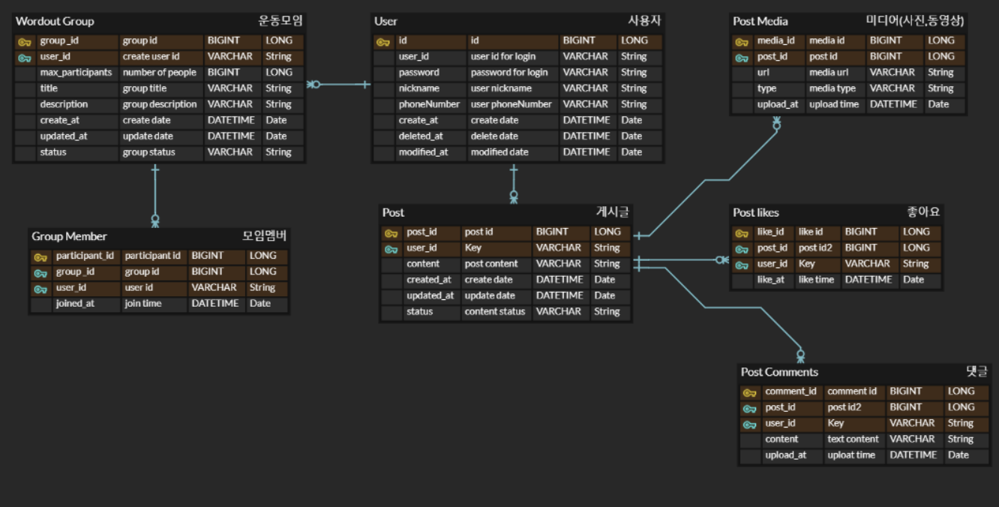

# Owoonwan
백엔드 개인 프로젝트 (운동 게시판 커뮤니티 사이트)

#  오운완 커뮤니티 사이트

자신만의 운동 기록을 공유하고, 게시판에 오운완 기록을 등록해서 사용자와 소통할수있고, 
운동 모임을 개설해서, 운동할 사람을 모집할 수 있는 커뮤니티 사이트

## 프로젝트 기능 및 설계

- 회원가입 기능
  - 사용자는 회원가입을 할 수 있다.
  - 닉네임과 아이디는 고유해야한다.
  - coolsms 에서 제공하는 sms API를 활용.
  - HttpSession을 사용해서, 인증번호 확인.
  ### 회원가입 API
  > **POST**  `[/join/request]` **기능 : 회원가입 요청** 
  > **Content** : 
  > `[{ id : 유저아이디 , password : 비밀번호 , nickname : 닉네임 , phoneNumber : 전화번호 }]`
  >  **Response** : `[{ status : 200 , description : "sms 발송"}]`

  > **POST**  `[/join/response]` **기능 : 인증 및 회원등록** 
  > **Content** :
  > `[{ verifyCode : 인증번호 }]`
  >  **Response** : `[{ status : 200 , description : "회원가입 완료"}]`

- 로그인 기능
    - 사용자의 ID와 Password를 통해서 로그인.
    - SpringSecurity 와 JWT를 통해서, 사용자 인증을 하고, 인증 토큰을 발급한다.
    - 토큰을 증명해야 서비스에 접근할 수 있다.

- 회원관리 기능
    - 사용자의 기본 정보를 표시한다.
    - 사용자가 게시한 게시글의 목록을 제공.
    - 회원 정보의 CRUD 기능 제공.

- 게시글 작성 기능
    - 사용자는 게시글을 작성할수있다.
    - 사용자는 자신의 게시글에 대해 CRUD가 가능하다.
    - 게시글에는 텍스트 기반의 게시글 내용과 미디어(사진,동영상)등이 포함될수있다. 갯수에는 제한이 없다. 
    - AWS S3를 사용해서 미디어 데이터를 저장한다.

- 게시글 조회 기능
    - 게시글은 최신순으로 기본 정렬되며, 좋아요, 댓글순으로 조회할 수 있다.
    - 게시글은 종류가 많을수 있으므로 paging 처리를 한다.
    - Redis의 Caching을 통해, 조회한 게시글에 대해 관리한다.
    - 한번 조회한 게시글은 캐시에 저장해놓고, 재조회시 빠르게 제공
    - 캐싱된 게시글은 일정 시간이 지나면 사라지고, hit가 발생할때마다, 캐시에 저장되는 
  시간을 늘려준다.

- 특정 게시글 검색 기능
    - 닉네임 또는 관련 내용을 통해서, 게시글을 조회할 수 있다.
    - 조회되는 게시글은 많을 수 있으므로 paging처리를 한다.
    - 조회되는 게시글은 최신순으로 정렬되서 제공된다.
    - Elasticsearch 를 활용해서, 사용자가 입력한 키워드 기반으로 검색을 실시한다.(기본기능 구현후 가능하면 추가예정)

- 게시글 좋아요 기능
    - 사용자는 맘에드는 게시글에 좋아요 누를 수 있다.
    - 데이터 무결성을 용이하게 하기 위해,좋아요 데이터는 Post likes 테이블을 통해 따로 관리된다.

- 댓글 기능
    - 사용자는 게시글에 댓글을 달 수 있다.
    - 댓글은 최신순으로 정렬되고, 게시글 조회시 기본 제공되는 댓글의 수 만큼 제공된다.
    - 댓글이 많을 경우, API를 통해서, 추가 댓글을 불러올 수 있다.
    - 댓글을 달은 사용자의 닉네임과 내용, 시간이 표기된다.
    

- 운동 모임 개설 기능
  - 사용자는 같이 운동을 할 수 있는 모임을 개설할 수 있다.
  - 운동 모임에는 인원 제한을 설정할 수 있고, 모임의 제목과 설명이 포함된다.

- 운동 모임 참여 기능
  - 사용자는 개설된 모임에 대해서 참여할 수 있다.
  - 인원이 가득찬 모임에 대해서는 참여할 수 없다.
  - Redis lock을 통해서 모임에 대한 동시성 제어를 실시한다.

- 운동 모임 탈퇴 기능
  - 사용자는 참여한 모임에 대해서 탈퇴할 수 있다.

- 운동 모임 그룹방 기능 (기획)
  - 운동 모임은 그룹방이 존재한다.
  - 그룹방에는 댓글과, 미디어를 게시할 수 있다.
  - 그룹에 포함된 멤버들은 그룹방에서 모임에 대한 운동기록을 공유할 수 있고, 그룹 간 커뮤니케이션 할 수 있다.
  - 시간 제약 사항으로 기본기능 구현후에 추후 가능하면 구현 예정입니다.

- 알림 기능(기획)
    - web Socket과 Redis pub/sub을 활용
    - 사용자의 게시글에 좋아요나 댓글이 달릴시 알람을 제공한다.
    - 시간 제약 사항으로 기본기능 구현후에 추후 가능하면 구현 예정입니다.

# ERD

